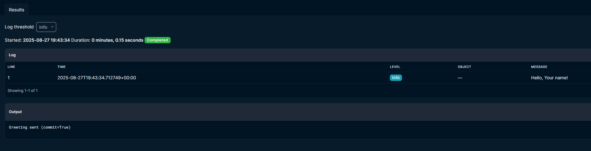

### **Hello Script (`01_hello_script.py`)**

A minimal NetBox Custom Script to demonstrate:

- **Inputs** (form fields in the UI)
- **Logging** (`log_info`)
- **Commit toggle** (dry-run vs. save changes)

It simply prints a greeting like `Hello, world!` or `Hello, <Name>`.

#### Example Screenshots

1. **Input Form in NetBox**

   

2. **Results**

   

[View Script](../scripts/01_hello_script.py)
