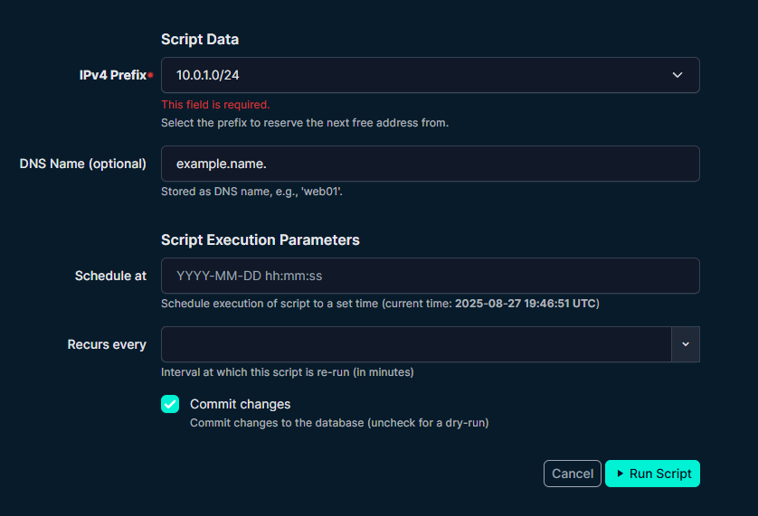
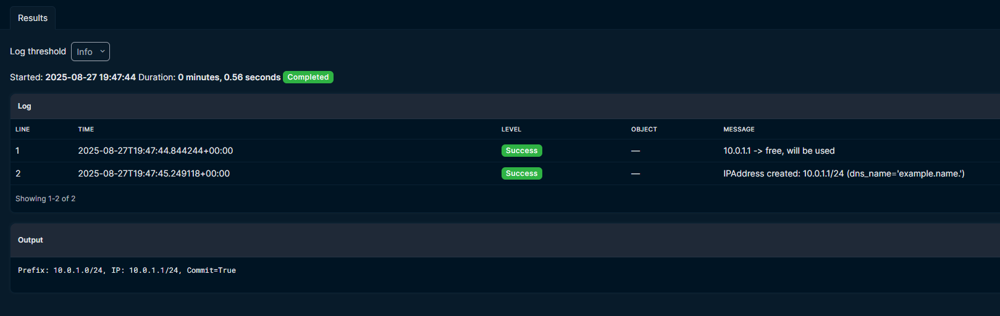
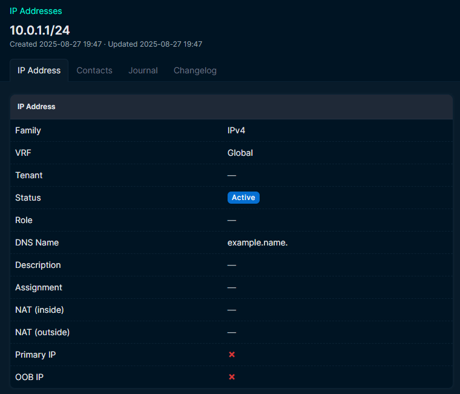

### **Reserve IPv4 Script (`02_reserve_ipv4.py`)**

A NetBox Custom Script to automate IPv4 assignment:

- Scans a chosen prefix for the **first unused IPv4**
- Creates a new **`IPAddress`** in NetBox (only when **Commit** is enabled)
- Optionally assigns a **DNS name**

#### Example Screenshots

1. **Input Form in NetBox**

   

2. **Results**

   

3. **Created IPv4 in NetBox**

   

[View Script](../scripts/02_reserve_ipv4.py)
